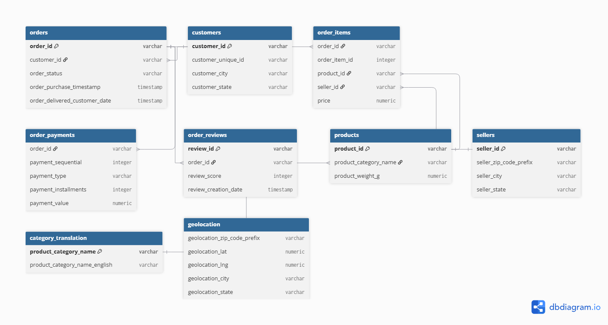

# E-Commerce Customer Churn & Cohort Analysis

## Objective
Analyze customer purchasing behavior, churn patterns, and cohort retention 
for a Brazilian e-commerce platform (Olist) to identify at-risk customer 
segments and revenue trends.

## Dataset
Brazilian E-Commerce Public Dataset by Olist (Kaggle), ~100k orders across 
9 relational tables (2016–2018).

## Tech Stack
PostgreSQL, Python (Pandas, Matplotlib/Seaborn), Power BI

## Schema

## Project Status
🚧 In Progress — Phase 1 (Data Acquisition, Schema Setup & Exploratory SQL) and Phase 2 (Cohort Retention Analysis, Churn Definition & RFM Segmentation) complete[cite: 2, 3]. 
Phase 3 (Python Visualizations & Power BI Dashboard Integration) in progress.

## Key Files
- `/sql/01_exploration.sql` — Initial exploratory queries (order trends, revenue by category, order value by state, payment methods, delivery metrics)[cite: 1]
- `/sql/02_cohort_analysis.sql` — Monthly cohort retention matrix using `customer_unique_id` to track customer return rates over time[cite: 2]
- `/sql/03_churn_rfm.sql` — 90-day threshold churn definition, overall churn rate calculation, and Quartile-based Recency, Frequency, and Monetary (RFM) customer scoring[cite: 3]

## Key Findings
- **High Churn Rate:** Based on a 90-day inactivity threshold from the dataset's latest purchase date, **90.21% (86,684 customers)** are classified as Churned, while only **9.79% (9,412 customers)** remain Active[cite: 3].
- **Steep Cohort Drop-Off:** Retention matrices show minimal repeat customer activity after Month 0 (e.g., the Oct 2016 cohort of 321 customers saw only 1–2 repeat buyers in subsequent months), confirming Olist operates predominantly as a single-transaction marketplace[cite: 2].
- **RFM Distribution:** Out of 96,096 unique customers, RFM scoring (using quartiles 1–4 across Recency, Frequency, and Monetary metrics) identified a highly concentrated tier of top-value champions (RFM score of 3), separating high-frequency buyers from dormant accounts[cite: 3].
- **Delivery Reliability:** 97.02% of orders were successfully delivered, with ~3% falling into canceled or unavailable statuses[cite: 1].
- **Average Delivery Time:** Orders take an average of 12.09 days from purchase to delivery across the platform[cite: 1].
- **Regional Fulfillment Gap:** Remote northern states (AP: 26.73 days, AM: 25.99 days, AL: 24.04 days) experience significantly longer delivery times than southern logistics hubs[cite: 1].
- **Payment Distribution:** Credit cards dominate transactions (~74%), followed by Boleto (~19%)[cite: 1].
- **Healthy Seller Ecosystem:** The top seller generated R$229,472.63 (~1.6–1.7% of platform GMV), demonstrating low platform concentration risk[cite: 1].